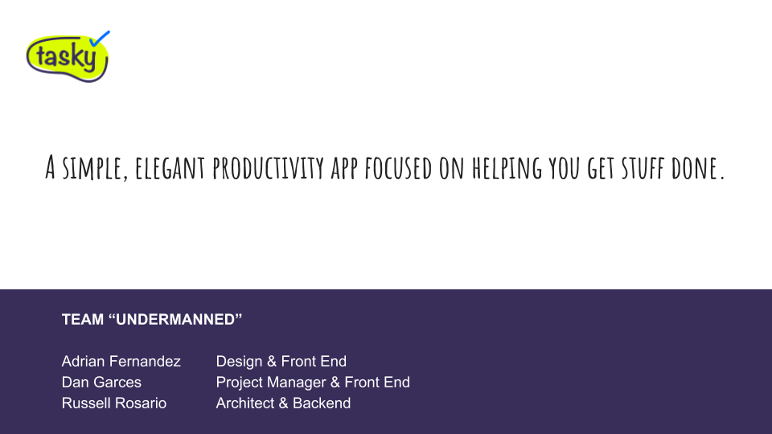
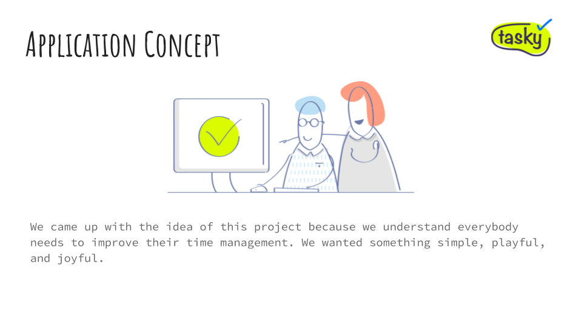

# Tasky - Productivity app

#### Project #2 for University of Miami's Full Stack Web Developer bootcamp completed in 1 week

##### This repository is for the backend ONLY. Backend API fully functional at https://agile-taiga-82794.herokuapp.com/

##### Angular frontend repo is can be found at https://github.com/rosariorussell/Tasky-angular-frontend

